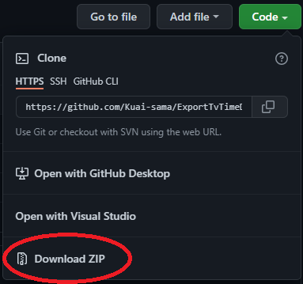
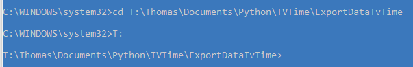

# ExportDataTvTime

## Introduction & why I create this script

I've been using Tv time for a long time and could never bring myself to switch to a more open platform. Tv time doesn't have a data export option, so I decided to create a python script to do this. 

I have added so many shows to watch that I never know where to start. I usually generate a random number between 1 and the maximum number of shows I have followed. Then I list the shows to see which one I got, it was long and tiring.

## Install
Install the project folder with all files that you need.



You need to install interpreter python, i used the [3.8.7 64-bit version](https://www.python.org/downloads/release/python-387/).
Don't forget to add python to PATH.
* ### Running with Visual Studio Code
    You can run the script with Visual Studio Code with [this documentation](https://code.visualstudio.com/docs/languages/python)
    You can now running the script, by pressing the ruuning button
    

* ### Running without IDE
  Before Running the script you need to change 2 strings in the python file :
   ``` 
    # connection
    tvtime = TVTimeWrapper(r"YourUserName", r"YourPassword")
    ```
    Replace ```YourUserName``` and ```YourPassword``` by your Username and your Password.

  You can execute IDLE and run the script or using cmd :
  * ##### IDLE version 
    Open TvTime.py and press F5

  * ##### CMD Version
    Get your folder path and copy it

    Open the cmd and write the command line :
        ```cd ``` and paste your path for changing your current directory

    if your path is in an other disk then write :```YourLetter:```

    Example :

    

    Next step is to execute the python script with command line : ```python TvTime.py ```

    Example :

    

## Be aware 
I haven't found a way to export movies and shows linked to the TvTime app, it seems that the website doesn't support them at the moment. It is possible that you have shows that are not included in the csv file. It's not my fault.

## How it works
In development progress

## Question & bugs report
In development progress
