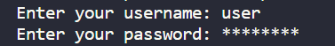
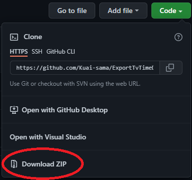

# ExportDataTvTime

## Introduction & why I create this script
I've been using TV Time for a long time and could never bring myself to switch to a more open platform. TV Time doesn't have a data export option, so I decided to create a python script to do this. 

I have added so many shows to watch that I never know where to start. I usually generate a random number between 1 and the maximum number of shows I have followed. Then I list the shows to see which one I got, it was long and tiring.

## Setting up
* dotenv
  
  Create a file named 'tvtime.env' in the 'env' folder and write the following inside: 
  ```
    TVTIME_CREDENTIALS = "user;passwd"
  ```
  Replace 'user' by your username and 'passwd' by your password. But keep the semicolon.

* input values

  If you don't use 'dotenv', you can directly write your login and password :

  


The advantage of using 'dotenv' is that you don't need to retype your login and password.

## Installation
Install the project folder with all the files that you need.



You need to install interpreter python, i used the [3.8.7 64-bit version](https://www.python.org/downloads/release/python-387/).
Don't forget to add Python to PATH.


* ### Running with Visual Studio Code
    You can run the script with Visual Studio Code with [this documentation](https://code.visualstudio.com/docs/languages/python)

    You can now running the script, by pressing the running button
    

* ### Running without IDE

  You can execute IDLE and run the script or using cmd :
  * ##### IDLE version 
    Open TvTime.py and press F5

  * ##### CMD Version
    Execute the python script with command line : ```python TvTime.py ```

## Be aware 
I haven't found a way to export movies and shows linked to the TvTime app, it seems that the website doesn't support them at the moment. It is possible that you have shows that are not included in the csv file. It's not my fault.

## How it works
In development progress
